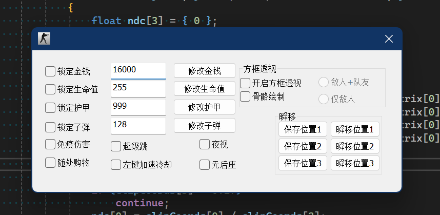

# ApplicationExtension
This is a code repository used to extend the functionality of the application.

## 1. pvz case
``` bash
通过百度网盘分享的文件：植物大战僵尸1_pc版
链接：https://pan.baidu.com/s/1Q6x_SWKC5TtOUL0Rra3_EQ?pwd=aavm 
提取码：aavm
```


## 2. cs1.6 case
```bash
通过百度网盘分享的文件：cs1.6
链接：https://pan.baidu.com/s/1Q1YUhA35y7iXHezmMZRqIg?pwd=170b 
提取码：170b
```



